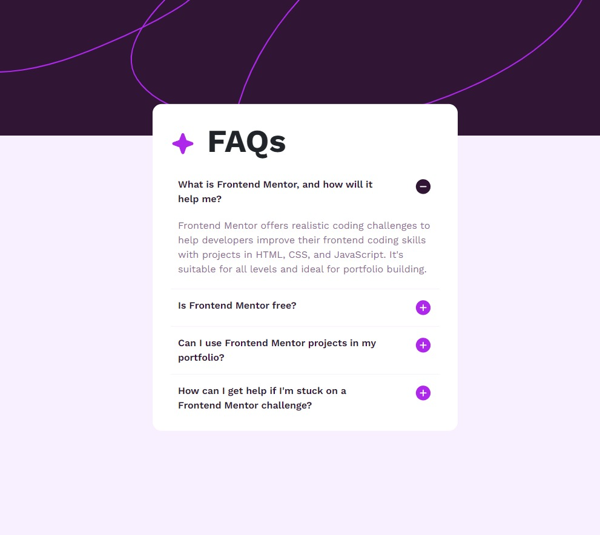

# Frontend Mentor - FAQ accordion solution

This is a solution to the [FAQ accordion challenge on Frontend Mentor]

## Table of contents

- [Screenshot](#screenshot)
- [Links](#links)
- [Built with](#built-with)
- [What I learned](#what-i-learned)
- [Continued development](#continued-development)
- [Useful resources](#useful-resources)
- [Author](#author)
- [Acknowledgments](#acknowledgments)


### The challenge

Users should be able to:

- Hide/Show the answer to a question when the question is clicked
- Navigate the questions and hide/show answers using keyboard navigation alone (they can use Tab to iterate over the questions and Enter/Space to open/close the corresponding answer)
- View the optimal layout for the interface depending on their device's screen size
- See hover and focus states for all interactive elements on the page

### Screenshot



### Links

- Live Site URL: https://danieldeaconescu.github.io/faq-accordion/

### Built with

- Semantic HTML5 markup
- CSS custom properties
- Flexbox
- Bootstrap
- Vanilla JavaScript
- Mobile-first workflow

### What I learned

This project gave me the opportunity to recap some basic JavaScript. Also, it was a great opportunity to use Bootstrap.

To see how you can add code snippets, see below:


```js
function toggleAnswer(index) {
    theAnswers[index].classList.toggle("display-none");
    const currentImageSrc = plusMinusImages[index].getAttribute("src");
    const newImageSrc =
      currentImageSrc === "assets/images/icon-plus.svg"
        ? "assets/images/icon-minus.svg"
        : "assets/images/icon-plus.svg";
    plusMinusImages[index].setAttribute("src", newImageSrc);
  }

  function handleKeyPress(event, index) {
    if (event.key === "Enter" || event.key === " ") {
      toggleAnswer(index);
    }
  }

  plusMinusButtons.forEach((button, index) => {
    button.addEventListener("click", () => {
      toggleAnswer(index);
    });
  });

  allQuestions.forEach((question, index) => {
    question.addEventListener("click", () => {
      toggleAnswer(index);
    });

    question.addEventListener("keypress", (event) => {
      handleKeyPress(event, index);
    });
  });
```

### Continued development

I would like to re-write the JavaScript for this project.

### Useful resources

- [Google Fonts](https://fonts.google.com/) 
- [Twitter Bootstrap](https://getbootstrap.com/)
- [w3schools] (https://www.w3schools.com/)

## Author

- Frontend Mentor - [@DanielDeaconescu](https://www.frontendmentor.io/profile/DanielDeaconescu)
